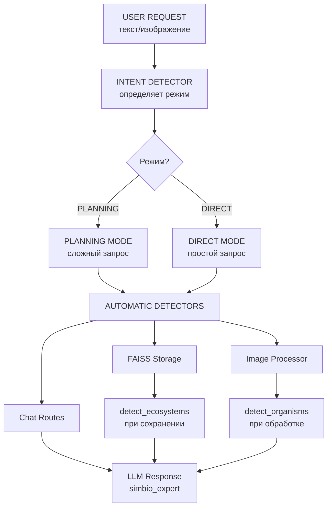
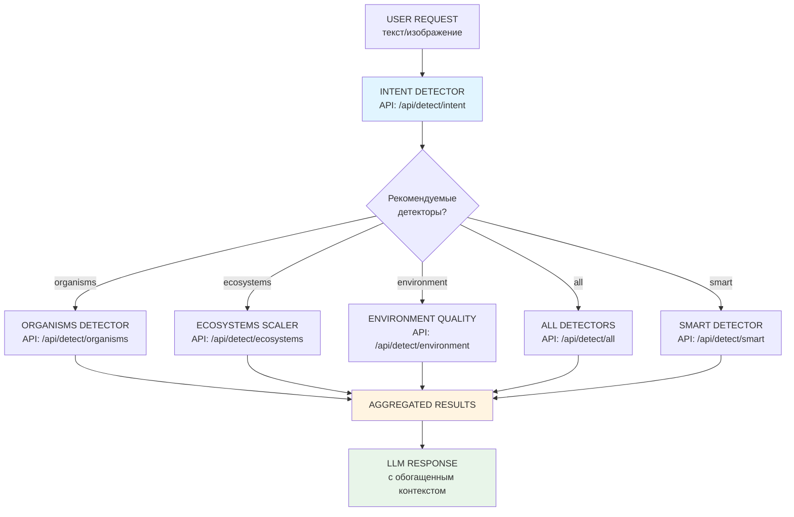

# Архитектура детекторов

## Текущая архитектура



## Новая архитектура с API



## Детекторы

### 1. **Intent Detector** (`intent_detector.txt`)
- **Назначение**: Определяет намерение пользователя и режим работы
- **Вход**: Текст запроса + контекст
- **Выход**: 
  - Режим (PLANNING/DIRECT)
  - Цель запроса
  - Требования
  - Сложность
  - Местоположение/Время
  - Уверенность

### 2. **Organism Detector** (`organism_detector.py`)
- **Назначение**: Обнаруживает организмы в тексте
- **Вход**: Текст
- **Выход**: Список организмов с названиями, типами, категориями
- **Используется**: 
  - В `image_processor.py` (при обработке изображений)
  - В `faiss.py` (при сохранении параграфов)

### 3. **Ecosystem Scaler** (`ecosystem_scaler.py`)
- **Назначение**: Обнаруживает экосистемы и определяет их масштаб
- **Вход**: Текст + данные локализации
- **Выход**: Список экосистем с масштабом, локализацией
- **Используется**: 
  - В `faiss.py` (при сохранении параграфов)

### 4. **Environment Quality** (`environment_quality.py`)
- **Назначение**: Извлекает данные о климате и состоянии окружающей среды
- **Вход**: Текст + данные локализации
- **Выход**: Климат, состояние среды, факторы для симбиозов
- **Используется**: 
  - В `image_processor.py` (при обработке изображений)

### 5. **Localize** (`localize.py`)
- **Назначение**: Извлекает локализацию и время из текста
- **Вход**: Текст
- **Выход**: Местоположение, временная ссылка

### 6. **Image Processor** (`image_processor.py`)
- **Назначение**: Обрабатывает изображения и извлекает данные
- **Вход**: Изображение (bytes)
- **Выход**: Описание, организмы, экосистемы, environment данные
- **Использует**: 
  - `detect_organisms`
  - `detect_ecosystems`
  - `detect_environment`

### 7. **Web Search** (`web_search.py`)
- **Назначение**: Поиск информации о симбиозах в интернете
- **Вход**: Текст запроса
- **Выход**: Контекст из веб-поиска

### 8. **Fact Check** (`factcheck.py`)
- **Назначение**: Проверка достоверности информации

### 9. **Relevance** (`relevance.py`)
- **Назначение**: Определение релевантности

### 10. **Role State** (`rolestate.py`)
- **Назначение**: Классификация типа сообщения

## Проблемы текущей архитектуры

1. **Нет прямого API для фронта** - детекторы вызываются только автоматически
2. **Нет связи с Intent Detector** - детекторы не вызываются на основе намерения
3. **Нет возможности выборочного вызова** - нельзя вызвать конкретный детектор

## Предлагаемая архитектура

```
┌─────────────────────────────────────────────────────────────────┐
│                         USER REQUEST                            │
│                    (текст, изображение)                         │
└────────────────────────────┬────────────────────────────────────┘
                             │
                             ▼
┌─────────────────────────────────────────────────────────────────┐
│                    INTENT DETECTOR                              │
│  (определяет режим, требования, нужные детекторы)               │
└────────────────────────────┬────────────────────────────────────┘
                             │
                             ▼
        ┌─────────────────────────────────────┐
        │   DETECTOR ROUTER                   │
        │  (вызывает нужные детекторы)        │
        └─────────────────────────────────────┘
                             │
        ┌────────────────────┼────────────────────┐
        │                    │                    │
        ▼                    ▼                    ▼
┌──────────────┐    ┌──────────────┐    ┌──────────────┐
│ ORGANISMS    │    │ ECOSYSTEMS   │    │ ENVIRONMENT  │
│ DETECTOR     │    │ SCALER       │    │ QUALITY      │
└──────┬───────┘    └──────┬───────┘    └──────┬───────┘
       │                   │                   │
       └───────────────────┼───────────────────┘
                           │
                           ▼
                ┌───────────────────────┐
                │  AGGREGATED RESULTS   │
                │  (объединенные данные)│
                └───────────────────────┘
                           │
                           ▼
                ┌──────────────────────┐
                │   LLM RESPONSE       │
                │  (с обогащенным      │
                │   контекстом)        │
                └──────────────────────┘
```

## API Endpoints

### 1. `POST /api/detect/intent`
Определяет намерение и рекомендует детекторы

**Request:**
```json
{
  "query": "Объясни разницу между микоризой и азотфиксацией",
  "context": "опциональный контекст"
}
```

**Response:**
```json
{
  "mode": "PLANNING",
  "goal": "объяснение разницы между процессами",
  "requirements": ["детальное объяснение", "сравнение"],
  "complexity": "ВЫСОКАЯ",
  "location": "не указано",
  "time": "не указано",
  "confidence": 0.9,
  "reason": "требуется многошаговое рассуждение",
  "recommended_detectors": ["organisms", "ecosystems"]
}
```

### 2. `POST /api/detect/organisms`
Вызывает детектор организмов

**Request:**
```json
{
  "text": "В лесу растут дубы и обитают птицы",
  "location_data": {"location": "Московская область"},
  "context": {}
}
```

**Response:**
```json
{
  "organisms": [
    {
      "name": "дуб",
      "scientific_name": "Quercus",
      "type": "растение",
      "category": "дерево"
    }
  ],
  "count": 1
}
```

### 3. `POST /api/detect/ecosystems`
Вызывает детектор экосистем

**Request:**
```json
{
  "text": "Лес производит кислород",
  "location_data": {"location": "Московская область"},
  "context": {}
}
```

**Response:**
```json
{
  "ecosystems": [
    {
      "name": "лес",
      "scale": "habitat",
      "location": "Московская область"
    }
  ],
  "count": 1
}
```

### 4. `POST /api/detect/environment`
Вызывает детектор окружающей среды

**Request:**
```json
{
  "text": "Летний лес с высокой влажностью",
  "location_data": {"location": "Московская область"},
  "context": {}
}
```

**Response:**
```json
{
  "environment": {
    "climate": {
      "temperature": "умеренная",
      "humidity": "высокая",
      "season": "лето"
    },
    "symbiosis_factors": {
      "biome_type": "лес",
      "symbiosis_conditions": "благоприятные"
    }
  },
  "confidence": 0.8
}
```

### 5. `POST /api/detect/all`
Вызывает все детекторы параллельно

**Request:**
```json
{
  "text": "Летний лес с дубами и птицами",
  "location_data": null,
  "context": {}
}
```

**Response:**
```json
{
  "organisms": {"organisms": [...], "count": 2},
  "ecosystems": {"ecosystems": [...], "count": 1},
  "environment": {"environment": {...}, "confidence": 0.8},
  "location": {"location": "Московская область"}
}
```

### 6. `POST /api/detect/smart`
Умный вызов на основе intent detection

**Request:**
```json
{
  "text": "Объясни влияние климата на биоразнообразие",
  "location_data": null,
  "context": {}
}
```

**Response:**
```json
{
  "intent": {
    "mode": "PLANNING",
    "recommended_detectors": ["ecosystems", "environment"]
  },
  "ecosystems": {...},
  "environment": {...},
  "location": {...}
}
```

## Использование на фронте

### Пример 1: Автоматический вызов на основе intent
```typescript
// 1. Определяем намерение
const intent = await fetch('/api/detect/intent', {
  method: 'POST',
  body: JSON.stringify({ query: userMessage })
});

// 2. Вызываем умный детектор
const results = await fetch('/api/detect/smart', {
  method: 'POST',
  body: JSON.stringify({ text: userMessage })
});

// 3. Используем результаты для обогащения контекста LLM
```

### Пример 2: Прямой вызов конкретного детектора
```typescript
// Если пользователь явно спрашивает про организмы
const organisms = await fetch('/api/detect/organisms', {
  method: 'POST',
  body: JSON.stringify({ text: userMessage })
});
```

### Пример 3: Вызов всех детекторов
```typescript
// Для максимального контекста
const allData = await fetch('/api/detect/all', {
  method: 'POST',
  body: JSON.stringify({ text: userMessage })
});
```

